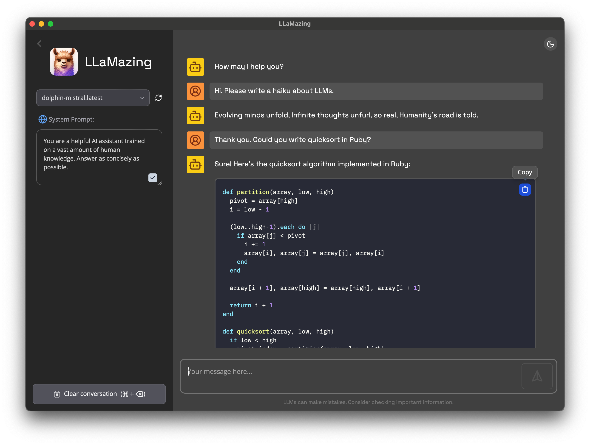

# LLaMazing

A simple frontend to Ollama.

| Light Theme               | Dark Theme               |
| ------------------------- | ------------------------ |
|  |  |

## Prerequisites

Install [Ollama](https://ollama.ai/) and run the server.

Download some [models](https://ollama.ai/library). For example, one of my favorites:

```shell
$ ollama pull dolphin-mistral
```

## Using LLaMazing

For using the app itself, there are 2 options:

- Web UI
- Stand-alone app

### Option 1 : Web UI

#### Install dependencies:

```shell
$ pnpm i
```

#### Run in browser (dev mode)

```shell
$ pnpm dev --open
```

## Option 2 : Standalone app

Build one yourself (see below) or download a release from https://github.com/da-z/llamazing/releases


**❗Note**: In order for the standalone app to work, you have to either manually start Ollama server like this:

```shell
$ OLLAMA_ORIGINS=*://localhost ollama serve
```

or set the property globally (once) and restart Ollama server

```shell
$ launchctl setenv OLLAMA_ORIGINS '*://localhost'
```

#### Running standalone app in dev mode

```shell
$ pnpm tauri dev
```

#### Building app (Mac Universal)

```shell
$ pnpm tauri build --target universal-apple-darwin
```

#### Building app for your system

```shell
$ pnpm tauri build
```

#### Building app with debugging enabled

Good for troubleshooting a build (enables dev tools):

```shell
$ pnpm tauri build --debug
```
